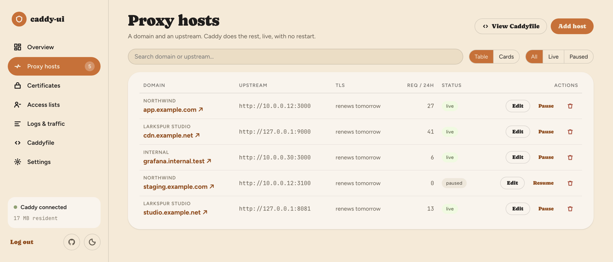

# Caddy Proxy UI


**A lightweight, native web UI for managing [Caddy](https://caddyserver.com) reverse
proxies on small servers.**

<picture>
  <source media="(prefers-color-scheme: dark)" srcset="docs/screenshot-dark.png">
  
</picture>

**The goal**: the convenience of tools like Nginx Proxy Manager, without the heavy
management stack (Node backend, Python/Certbot, external DB) that usually comes with it
— small enough to run alongside something else on a 1GB VPS. Not a smaller Caddy; Caddy
is already good at this. Just no extra weight around it.

Add a domain and an upstream in the UI; Caddy handles the reverse proxy, automatic
HTTPS, and certificate renewal — live, with no config file writes and no restarts.
`caddy-ui` is one small Go binary (REST API + SQLite + embedded Svelte frontend, static,
no CGO) that drives Caddy over its Admin API. Caddy itself stays completely standard —
this doesn't wrap or replace it, and you can always drop out to a hand-written Caddyfile.

**Non-goals:** multi-user/RBAC, replacing the Caddyfile as a format, and storing
telemetry — the Logs & traffic page is a live window on Caddy's own access log, kept in
memory for 24 hours and re-read from the file on restart. Nothing is retained beyond
Caddy's own rotation, and there is no time-series database here. This is a UI for the
90% case (`domain → upstream, please`), not a Caddy config IDE or a full DevOps platform.

Measured idle footprint (native Linux, both processes, dev hardware — not a guarantee for
yours): `caddy-ui` ~19 MB RAM, ~60 MB combined with Caddy, ~0% CPU. Two Go dependencies,
zero frontend runtime dependencies. The Overview page reports this instance's own real
resident memory, so you can check it on your own box rather than trusting this line.

## Features

- Proxy hosts: add/edit/delete/enable/disable, with custom request headers
- Automatic HTTPS (Caddy's default), live reload via the Admin API — no restarts
- Certificates: real expiry and issuer, read straight from Caddy's own storage. A view,
  not a manager — Caddy still owns issuance and renewal
- Access lists: basic auth and IP allow/deny rules per host, enforced by Caddy before a
  request reaches your upstream
- Logs & traffic: the access log tailed live, with 24h request and error counts per host
- Caddyfile import (conservative — anything it can't safely translate is reported as
  *skipped*, never silently dropped) and clean Caddyfile export
- Single-admin login, no default credentials; Caddy connectivity indicator
- Light and dark themes; works down to phone width
- Native Linux install (systemd) — Docker is optional, not required

## Quick start

```bash
curl -fsSL https://raw.githubusercontent.com/chnthkksn/caddy-proxy-ui/main/contrib/install.sh | sudo bash
```

Shows a menu — nothing runs until you pick an option (install, update, reset-password,
uninstall, status, ...). Choosing install checks ports 80/443/8080 are free before
touching anything, installs Caddy if it's missing, downloads the latest `caddy-ui`
binary, sets it up as a systemd service, and prints the URL to open. Then create the
administrator account — there's no default login.

Because the menu waits for input, automated runs need to name a command instead. Pass it
after `-s --`:

```bash
curl -fsSL https://raw.githubusercontent.com/chnthkksn/caddy-proxy-ui/main/contrib/install.sh | sudo bash -s -- install
```

Commands: `install`, `install-caddy`, `run`, `update`, `reset-password`,
`uninstall [--purge]`, `status`, `help`.

Prefer Docker? That's supported too:

```bash
git clone https://github.com/chnthkksn/caddy-proxy-ui.git && cd caddy-proxy-ui
docker compose up -d
```

### Configuration

| Variable | Native default | Docker Compose value |
|---|---|---|
| `CADDY_ADMIN_URL` | `http://localhost:2019` | `http://caddy:2019` |
| `CADDY_ADMIN_LISTEN` | `127.0.0.1:2019` | `0.0.0.0:2019` |
| `DB_PATH` | `/var/lib/caddy-ui/caddy-ui.db` | `/data/caddy-ui.db` |
| `LISTEN_ADDR` | `:8080` | `:8080` |
| `COOKIE_SECURE` | `false` | `false` |
| `ACCESS_LOG_PATH` | `/var/log/caddy-ui/access.log` | `/var/log/caddy-ui/access.log` |
| `CADDY_STORAGE_PATH` | `/var/lib/caddy/.local/share/caddy` | `/caddy-data/caddy` |

The last two are what make the Logs and Certificates pages work, and both involve two
processes sharing a directory:

- **Access log** — caddy-ui tells Caddy to write its access log here, then tails it.
  `install.sh` creates a `caddy-ui-logs` group and a setgid directory so Caddy can write
  and caddy-ui can read. Under Docker it's a small dedicated volume.
- **Certificate storage** — read-only. `install.sh` grants access with a POSIX *default*
  ACL (`setfacl -d`), which is why `acl` is installed on native setups: a plain `chmod`
  would only cover certificates that already exist, not ones Caddy issues later. Under
  Docker it's the existing `caddy_data` volume mounted `:ro`.

Both degrade honestly. If either path is unreadable, that page says so rather than
showing an empty list that looks like "no certificates" or "no traffic".

## How it works

SQLite is the source of truth. Every mutation writes to SQLite first, then rebuilds the
full Caddy config and pushes it via `POST /load`. If Caddy is briefly unreachable, the
write still succeeds — the UI shows a "Caddy offline" banner and reconciles once it's
back, instead of failing the request. Caddy always runs as its own separate process (or
container); if `caddy-ui` disappears, Caddy just keeps running with the last config
pushed to it.

## Contributing

Issues and PRs welcome. A few ground rules:

- **Keep it tiny** — stdlib `net/http`, no router/framework. Two Go dependencies
  (`x/crypto` for bcrypt, `modernc.org/sqlite` for pure-Go SQLite) and zero frontend
  runtime dependencies; check the standard library covers something before adding a
  third. Certificate parsing, log tailing and the traffic chart are all stdlib and CSS.
- **No invented numbers** — every value in the UI traces to something real. If the data
  isn't available, the page says so ("storage not readable", "access log not
  configured") rather than rendering a plausible zero or a placeholder.
- **SQLite stays the source of truth** — host mutations go through
  `internal/service.ProxyService`, the only place allowed to touch both the DB and
  Caddy's Admin API.
- **Import never silently drops config** — anything the Caddyfile importer can't
  confidently translate should come back as a reported "skipped" item.
- **Caddy stays a separate process** — don't import it as a library, tempting as that is.
  Caddy owns TLS, ACME and certificate storage; embedding it would move all of that
  inside `caddy-ui`, tie your proxy's uptime to this UI's crashes and upgrades, and break
  the promise that you can stop using this tool and keep a plain, standard Caddy.
- **Assets stay local** — the three fonts in `web/src/fonts/` are self-hosted (~76 KB of
  variable woff2). A self-hosted proxy manager shouldn't reach a CDN to render its own
  dashboard.

Local dev: `go run ./cmd/caddy-ui`, and in `web/`, `pnpm install && pnpm run dev`.
`pnpm run check` and `go vet ./...` should both stay clean.

## License

[MIT](LICENSE)
